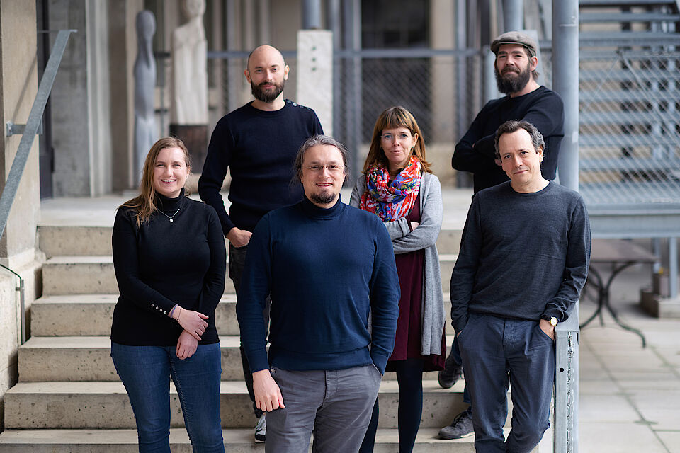
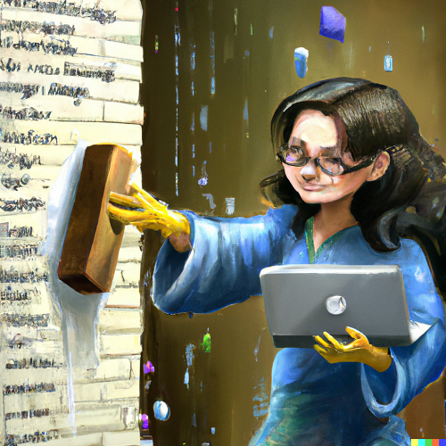
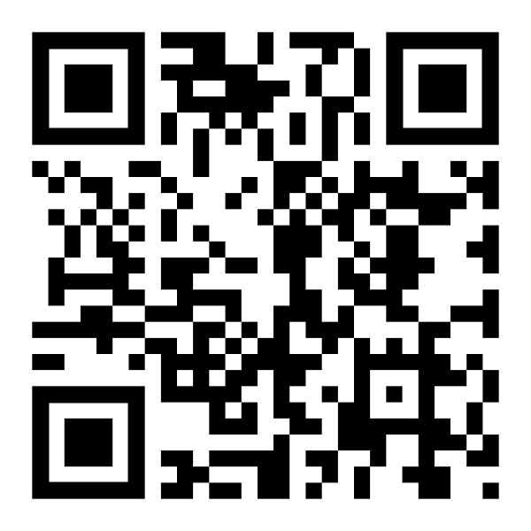

# Program

- 08:30 Course introduction
- 08:45 Brief introduction to version control with Git
- 09:15 Introduction to documentation with examples from Python
- 10:00 Break
- 10:15 Version control and documentation with GitHub
- 11:45 Explanation of assignment
- 12:00 Lunch
- 13:00-13:15 Recap clean code crash course
- 13:15-14:15 Clean code in context
- 14:15-14:30 Break
- 14:30-15:15 General input for cooperation and/or exercise
group work
- 15:15-16:00 Clean coding with AI

# About us

- Email: rise@unibas.ch 
- Web: https://rise.unibas.ch/
- GitHub: https://github.com/RISE-UNIBAS

# Today's goal

Understand how using version control, clean code and documentation can be used to:

- read and maintain your code
- comply with [FAIR data principles](https://force11.org/info/the-fair-data-principles/) and [FAIR4RS principles](https://zenodo.org/record/6623556#.Y-uTsq2ZNaQ) (see also [Barker et al. 2022](https://doi.org/10.1038/s41597-022-01710-x)) 
- avoid tech debt

# Course materials

Available right now at [https://github.com/RISE-UNIBAS/clean-code](https://github.com/RISE-UNIBAS/clean-code)
