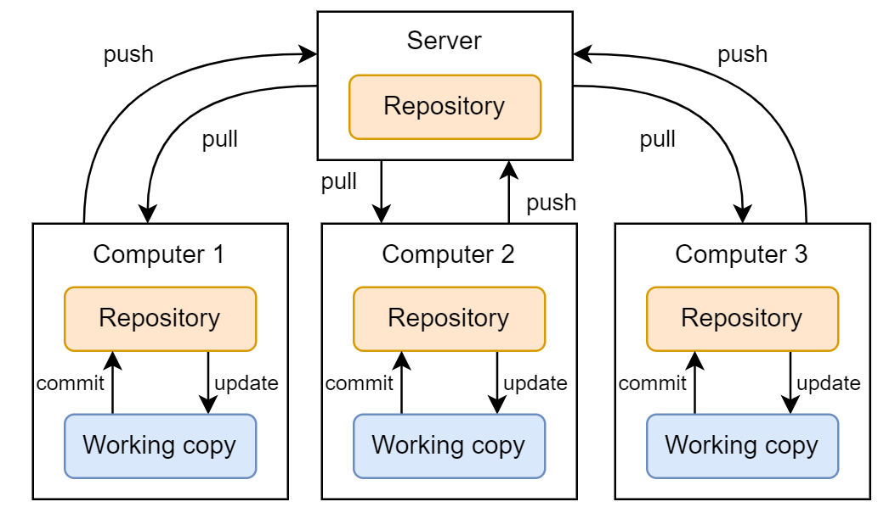

# Program

- 0900-0915 Introduction
- 0915-0930 Version control with Git
- 0930-1000 Git(Hub) core concepts and live demo
- 1000-1015 Primer on documentation
- 1015-1045 GitHub documentation and best practices
- 1045-1100 Q&A

# About us

- Email: rise@unibas.ch
- Web: https://rise.unibas.ch/
- GitHub: https://github.com/RISE-UNIBAS

# Today's goal

- Get you in a position to decide if Git(Hub) is relevant to your work.
- Get you in a position to start writing great documentation.
- Understand how using version control and documentation can be used to:
  - read and maintain your code
  - comply with [FAIR data principles](https://force11.org/info/the-fair-data-principles/) and [FAIR4RS principles](https://zenodo.org/record/6623556#.Y-uTsq2ZNaQ) (see also [Barker et al. 2022](https://doi.org/10.1038/s41597-022-01710-x))
  - avoid tech debt

# Course materials

Available right now at [https://github.com/RISE-UNIBAS/clean-code](https://github.com/RISE-UNIBAS/clean-code)

# Version control with Git

# What is Git?

- Git is a distributed version control system (VCS).
- A VCS is "a system that records changes to a file or set of files over time so that specific versions can be recalled later" (Chacon & Straub 2014: 10).
- Git is very well suited for text-like data such as code, but of course also for text-like data such as:
    - an ALTO-XML file encoding the transcript of a medieval manuscript
    - a CSV file recording numerical weather data for Basel
    - a JSON-LD file containing a Tropy database
    - an SVG file of a research project's fancy new logo
    - a TXT file containing a novel from Project Gutenberg
- Git is less well suited for binary data such as audio data, images or video (changes in these files are opaque), especially if these files are large (>100MB); use [Git Large File Storage extension ](https://git-lfs.com/)in such cases.

# Local version control

- Solves the problem of error-prone manual versioning of files.

# Centralized version control

- Solves the problem of how to work on the same files together on different computers.

# Distributed version control

- Solves the problem of being dependent on central server for work and backup.

# Using Git

After installation on your computer, you can use Git:

- via the command line
- via one of many [GUI-clients](https://git-scm.com/downloads/guis)
- via most common IDEs

# Git repository hosting services

But where do I host my Git repository? Do I have to configure a server myself? 

- No. In practice, most users rely on a commercial Git repository hosting service such as [GitHub](https://github.com/), [GitLab](https://gitlab.com/), [Bitbucket](https://bitbucket.org/), or others.

- Git repository hosting services do not replace but extend Git!

# GitLab at Unibas

In contrast to GitHub, GitLab can be installed on your own infrastructure (e.g., required for sensitive data).

There are several GitLab instances at Unibas but none run as official university-wide service:

- [https://git.scicore.unibas.ch/](https://git.scicore.unibas.ch/)
- [https://gitlab.psychologie.unibas.ch/](https://gitlab.psychologie.unibas.ch/)
- [https://gitlab.switch.ch/ub-unibas/](https://gitlab.switch.ch/ub-unibas/)
- [https://gitlab.its.unibas.ch/](https://gitlab.its.unibas.ch/)

# National infrastructure

Switch offers a GitLab instance, c4science supports Git:

- [https://gitlab.switch.ch/](https://gitlab.switch.ch/)
- [https://c4science.ch/](https://c4science.ch/)

# Looking at a sample GitHub repository

GitHub repo for these slides: [https://github.com/RISE-UNIBAS/clean-code/blob/main/crash-course-github/slides.md](https://github.com/RISE-UNIBAS/clean-code/blob/main/crash-course-github/slides.md)

Image credit: [Alex Eylar, "Inception", CC BY-NA-SA 2.0](https://www.flickr.com/photos/hoyvinmayvin/4829301976).

# Git(Hub) core concepts 

# Configure your GitHub Pro account

There is a [difference in functionality](https://docs.github.com/en/get-started/learning-about-github/githubs-plans) between GitHub Free and GitHub Pro accounts. For example, GitHub Free accounts cannot use GitHub pages.

## Task 1
As a student, you can get a free GitHub Pro account:

1. Sign up at https://github.com/ with your university email and choose GitHub Free.
2. [Verify](https://docs.github.com/en/account-and-profile/setting-up-and-managing-your-personal-account-on-github/managing-email-preferences/verifying-your-email-address) your email.
3. Fill in your [billing information](https://github.com/settings/billing/payment_information) with your full legal name as it appears on your academic affiliation documentation. (You do not have to add a payment method.)
4. Go to https://education.github.com/benefits and get a free upgrade to GitHub Pro by following the prompts.

# Connect to GitHub

There are [various ways](https://docs.github.com/en/get-started/using-github/connecting-to-github#comparison-of-tools-for-connecting-to-github) in which you can interact with GitHub. In this course, we limit ourselves to the following:

1. The web-interface on https://github.com/ in your browser.
2. [GitHub Desktop](https://docs.github.com/en/desktop/overview/about-github-desktop).

## Task 2

Please install GitHub Desktop on your machine. 

If you want to use your IDE instead of GitHub Desktop, you are free to do so, but we can only offer limited support, namely for [PyCharm](https://www.jetbrains.com/pycharm/) or [RStudio](https://github.com/rstudio/rstudio).

# Repository

_A repository is the most basic element of GitHub. They're easiest to imagine as a project's folder. A repository contains all of the project files (including documentation), and stores each file's revision history. Repositories can have multiple collaborators and can be either public or private._

From [GitHub glossary/repository](https://docs.github.com/en/get-started/learning-about-github/github-glossary#repository)

## Task 3: Create a repository on with the GitHub web-interface

- read the [documentation](https://docs.github.com/en/repositories/creating-and-managing-repositories/creating-a-new-repository) on how to create a new repository with the GitHub web-interface
- create a new public "test"-repository and include a README file with the web-interface

# Commit

_A commit, or "revision", is an individual change to a file (or set of files). When you make a commit to save your work, Git creates a unique ID (a.k.a. the "SHA" or "hash") that allows you to keep record of the specific changes committed along with who made them and when. Commits usually contain a commit message which is a brief description of what changes were made._

From [GitHub glossary/commit](https://docs.github.com/en/get-started/learning-about-github/github-glossary#commit)

## Task 4: Commit to a repository with the GitHub web-interface
- add some text to the README file and commit the changes with the GitHub web-interface

# Clone

_A clone is a copy of a repository that lives on your computer instead of on a website's server somewhere, or the act of making that copy. When you make a clone, you can edit the files in your preferred editor and use Git to keep track of your changes without having to be online. The repository you cloned is still connected to the remote version so that you can push your local changes to the remote to keep them synced when you're online._

From [GitHub glossary/clone](https://docs.github.com/en/get-started/learning-about-github/github-glossary#clone)

## Task 5: Sign in to GitHub Desktop
- read the [documentation](https://docs.github.com/en/desktop/installing-and-authenticating-to-github-desktop/authenticating-to-github-in-github-desktop) on how to sign in to GitHub Desktop
- sign in to GitHub Desktop

## Task 6: Clone a repository with GitHub Desktop
- read the [documentation](https://docs.github.com/en/desktop/adding-and-cloning-repositories/cloning-and-forking-repositories-from-github-desktop#cloning-a-repository) on how to clone a repository with GitHub Desktop
- clone the "test"-repository with GitHub Desktop

# Push

_To push means to send your committed changes to a remote repository on GitHub.com. For instance, if you change something locally, you can push those changes so that others may access them._

From [GitHub glossary/push](https://docs.github.com/en/get-started/learning-about-github/github-glossary#push)

## Task 7: Push a commit to remote with GitHub Desktop
- open the README file on the local "test"-repository, add some text, and save the file
- read the [documentation](https://docs.github.com/en/desktop/making-changes-in-a-branch/committing-and-reviewing-changes-to-your-project-in-github-desktop#write-a-commit-message-and-push-your-changes) on how to commit and push your changes with GitHub Desktop
- commit your changes to the "main"-branch of the "test"-repository with GitHub Desktop
- push your changes to the remote "test"-repository with GitHub Desktop

# Branches

_A branch is a parallel version of a repository. It is contained within the repository, but does not affect the primary or main branch allowing you to work freely without disrupting the "live" version. When you've made the changes you want to make, you can merge your branch back into the main branch to publish your changes._

From [GitHub glossary/branch](https://docs.github.com/en/get-started/learning-about-github/github-glossary#branch)

## Task 8: Create a "new"-branch with the GitHub web-interface
- read the [documentation](https://docs.github.com/en/pull-requests/collaborating-with-pull-requests/proposing-changes-to-your-work-with-pull-requests/creating-and-deleting-branches-within-your-repository#creating-a-branch) on creating branches with the web-interface
- create a branch called "new" with the web-interface

## Task 9: Commit to "new"-branch with the GitHub web-interface
- read the [documentation](https://docs.github.com/en/repositories/configuring-branches-and-merges-in-your-repository/managing-branches-in-your-repository/viewing-branches-in-your-repository) on viewing branches with the web-interface
- commit a new TXT file called "hello.txt" to the "new"-branch with the web-interface

# Pull

_Pull refers to when you are fetching in changes and merging them. For instance, if someone has edited the remote file you're both working on, you'll want to pull in those changes to your local copy so that it's up to date._

From [GitHub glossary/pull](https://docs.github.com/en/get-started/learning-about-github/github-glossary#pull)

## Task 10: Switch to "new"-branch with GitHub Desktop
- read the [documentation](https://docs.github.com/en/desktop/making-changes-in-a-branch/managing-branches-in-github-desktop#switching-between-branches) on switching branches with GitHub Desktop
- switch to "new"-branch with GitHub Desktop

# Merge and pull requests

_Merging takes the changes from one branch (in the same repository or from a fork), and applies them into another. This often happens as a "pull request" (which can be thought of as a request to merge), or via the command line. A merge can be done through a pull request via the GitHub.com web interface if there are no conflicting changes, or can always be done via the command line._

From [GitHub glossary/merge](https://docs.github.com/en/get-started/learning-about-github/github-glossary#merge)

## Task 11: Merge "new"-branch into main via a pull request
- read the [documentation](https://docs.github.com/en/desktop/working-with-your-remote-repository-on-github-or-github-enterprise/creating-an-issue-or-pull-request-from-github-desktop#creating-a-pull-request) on creating a pull request with GitHub Desktop
- create a pull request from "new"-branch into "main"-branch with GitHub Desktop
- read the [documentation](https://docs.github.com/en/pull-requests/collaborating-with-pull-requests/incorporating-changes-from-a-pull-request/merging-a-pull-request#merging-a-pull-request) on merging pull requests with the web-interface
- merge the pull request with the web-interface

## Task 12: Delete the "new"-branch with the GitHub web-interface
- read the [documentation](https://docs.github.com/en/repositories/configuring-branches-and-merges-in-your-repository/managing-branches-in-your-repository/deleting-and-restoring-branches-in-a-pull-request#deleting-a-branch-used-for-a-pull-request) on deleting branches with the web-interface
- delete the "new"-branch with the web-interface

# Optional tasks

## Task 13: review a pull request
- read the [documentation](https://docs.github.com/en/pull-requests/collaborating-with-pull-requests/reviewing-changes-in-pull-requests/about-pull-request-reviews) on pull request reviews
- pair up with one of your peers from this course
- clone their "test"-repository
- change a file and make a pull request
- review their pull request to your "test"-repository

## Task 14: create and resolve a merge conflict
- read the [documentation](https://docs.github.com/en/pull-requests/collaborating-with-pull-requests/addressing-merge-conflicts/about-merge-conflicts) on merge conflicts
- create a merge conflict in your "test"-repository
- try to resolve the merge conflict

# Primer on documentation

# Why is documentation important?

Without documentation your future self (let alone other people) won't be able to easily read your code and your code won't be FAIR : 

> "Software, including its documentation and license, should meet domain-relevant community
standards and coding practices (e.g., choice of programming language, standards for testing,
usage of file formats, accessibility [...]) that enable reuse" ([Chue Hong et al. 2022: 13](https://doi.org/10.15497/RDA00068)).

In addition, apart from the time and money spent (re)understanding your undocumented code, this potentially means many missed out opportunities, including:

- Publications (results not reproducible or black boxed)
- Collaboration
- Funding

# Different levels of documentation

Documentation is required at different levels of your research project:

1. Project level
2. User level
3. Systems level

Image credit: [xkcd, "Documents", CC BY-NA 2.5](https://xkcd.com/1459/).

# Project level documentation

A README file provides information about your files (code, data, and others) and how they are interrelated. The University of Basel's RDMN provides more [resources on data and file organization](https://researchdata.unibas.ch/en/planning/data-organisation/). The structure of a README file should include:

- General information
- File overview
- Sharing and access information
- Methodological information
- File-specific information

# User level documentation

"IEEE Standard for Software User Documentation" in IEEE Std 1063-1987: 1-20, [10.1109/IEEESTD.1988.121943](https://doi.org/10.1109/IEEESTD.1988.121943).

In order to create good user software documentation, answer the following questions:

1. What part(s) of the software need to be documented?
2. Who is the audience of the documentation? 
3. What is the information required by the target audience?
4. What is the usage mode of the documentation?

# GitHub best practices

# README.md
_You can add a README file to your repository to tell other people why
your project is useful, what they can do with your project, and how they can use it._ 

From the [GitHub documentation](https://docs.githubcom/en/repositories/managing-your-repositorys-settings-and-features/customizing-your-repository/about-readmes) on README files

## Materials
- The README file of this course is [here](https://github.com/RISE-UNIBAS/clean-code/blob/main/README.md).
- README templates and suggestions on [https://www.makeareadme.com/](https://www.makeareadme.com/).

## Questions
- What is `.md` for a file type?
- What should go into a README file? 
- How many README files does one need?

# LICENSE.md
_Public repositories on GitHub are often used to share open source software. For your repository to truly be open source, you'll need to license it so that others are free to use, change, and distribute the software._

From the [GitHub documentation](https://docs.github.com/en/repositories/managing-your-repositorys-settings-and-features/customizing-your-repository/licensing-a-repository) on licensing a repository

## Materials
- [Primer on intellectual property rights](https://researchdata.unibas.ch/en/legal-issues/intellectual-property-rights/) by the University of Basel's Research Data Management-Network.
- Choose a license with [https://choosealicense.com/](https://choosealicense.com/).

## Questions
- Why do you need a license for research software or research data?
- What are suitable licenses in this context?

# CITATION.cff
_You can add a CITATION.cff file to the root of a repository to let others know how you would like them to cite your work. The citation file format is plain text with human- and machine-readable citation information._

From the [GitHub documentation](https://docs.github.com/en/repositories/managing-your-repositorys-settings-and-features/customizing-your-repository/about-citation-files) on CITATION files

## Materials
- The CITATION file of this course is [here](https://github.com/RISE-UNIBAS/clean-code/blob/main/CITATION.cff).
- You can use the [cffinit](https://citation-file-format.github.io/cff-initializer-javascript/#/) tool to create or update your CITATION file.

## Questions
- What is an ORCID ID, what is a DOI?

# Releases
_GitHub's way of packaging and providing software to your users._

From [GitHub glossary/release](https://docs.github.com/en/get-started/learning-about-github/github-glossary#release)

## Materials
- The releases of this course are [here](https://github.com/RISE-UNIBAS/clean-code/releases).
- Releases should adhere to [semantic versioning](https://semver.org/spec/v2.0.0.html).
- [GitHub documentation](https://docs.github.com/en/repositories/releasing-projects-on-github) on releases.

## Questions
- What do I put in the release notes?

# Zenodo pipeline
GitHub repositories can be published to [Zenodo](https://zenodo.org/) as releases. 

## Materials
-  [GitHub documentation](https://docs.github.com/en/repositories/archiving-a-github-repository/referencing-and-citing-content#issuing-a-persistent-identifier-for-your-repository-with-zenodo) on issuing a persistent identifier for your repository with Zenodo-
- A more detailed documentation is [here](https://github.com/RISE-UNIBAS/clean-code/tree/main/course/github/zenodo_pipeline.md).

# CHANGELOG.md
_A changelog is a file which contains a curated, chronologically ordered list of notable changes for each version of a project._ 

From [https://keepachangelog.com/en/1.1.0/](https://keepachangelog.com/en/1.1.0/)

## Materials
- The CHANGELOG file of this course is [here](https://github.com/RISE-UNIBAS/clean-code/blob/main/CHANGELOG.md).
- CHANGELOG templates and suggestions on [https://keepachangelog.com/en/1.1.0/](https://keepachangelog.com/en/1.1.0/).

## Questions
- Why keep a changelog?
- Who needs a changelog?

# GitHub pages

_A static site hosting service designed to host your personal, organization, or project pages directly from a GitHub repository._

From [GitHub glossary/GitHub pages](https://docs.github.com/en/get-started/learning-about-github/github-glossary#github-pages)

## Materials
- [GitHub pages documentation](https://docs.github.com/de/pages).
- [Guide](https://github.com/nicolas-van/easy-markdown-to-github-pages?tab=readme-ov-file) on how to turn Markdown files in your repo into a website.

## Questions
- What's the advantage of having your documentation on GitHub pages?

# Advanced topics: secrets, collaboration, automation

- How to keep your data and credentials safe?
  - login credentials, API keys
- How to collaborate using GitHub?
  - pull requests
  - branch protection
  - forking
  - issues
  - project management tools

- How to automate routine tasks or build data processing pipelines?
  - [Documentation](https://docs.github.com/en/actions) on GitHub actions

# Getting help

- Documentation (see links below)
- Google is your friend
- [Stackoverflow](https://stackoverflow.com/)
- GPTs
- rise@unibas.ch

# References and further reading

- Bernd Öggl and Michael Kofler (2022): Git. Projektverwaltung für Entwickler und DevOps-Teams, Rheinwerk Computing
- Chue Hong et al. (2022): "FAIR Principles for Research Software (FAIR4RS Principles) (1.0)", [https://doi.org/10.15497/RDA00068](https://doi.org/10.15497/RDA00068)
- [GitHub glossary](https://docs.github.com/en/get-started/learning-about-github/github-glossary#commit)
- [GitHub documentation](https://docs.github.com)
- [GitHub Desktop documentation](https://docs.github.com/en/desktop)
- [GitHub template for FAIR and open research data](https://github.com/maehr/open-research-data-template) by Moritz Maehr
- Mariano Anaya (2022): Clean Code in Python. Develop maintainable and efficient code, Packt Publishing
- [Research Data Management-Network University of Basel](https://researchdata.unibas.ch/en/)
- [Scott Chacon and Ben Straub (2014): Pro Git, Apress](https://git-scm.com/book/en/v2)
- [Tons of material online and in print about Git](https://git-scm.com/doc/ext)

# 

