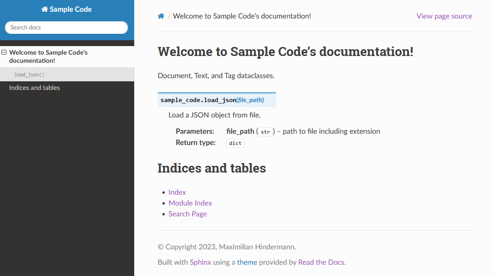

# Goal of this section on documentation


Get you in a position to start writing great documentation.

# Why is documentation important?

Without documentation your future self (let alone other people) won't be able to easily read your code and your code won't be FAIR : 

> "Software, including its documentation and license, should meet domain-relevant community
standards and coding practices (e.g., choice of programming language, standards for testing,
usage of file formats, accessibility [...]) that enable reuse" ([Chue Hong et al. 2022: 13](https://doi.org/10.15497/RDA00068)).

In addition, apart from the time and money spent (re)understanding your undocumented code, this potentially means many missed out opportunities, including:

- Publications (results not reproducible or black boxed)
- Collaboration
- Funding

# Different levels of documentation


Documentation is required at different levels of your research project:

1. Project level
2. User level
3. Systems level

Image credit: [xkcd, "Documents", CC BY-NA 2.5](https://xkcd.com/1459/).

# Project level documentation

A readme file provides information about your files (code, data, and others) and how they are interrelated. The University of Basel's RDMN provides more [resources on data and file organization](https://researchdata.unibas.ch/en/planning/data-organisation/). The structure of a readme file should include:

- General information
- File overview
- Sharing and access information
- Methodological information
- File-specific information

# User level documentation

"IEEE Standard for Software User Documentation" in IEEE Std 1063-1987: 1-20, [10.1109/IEEESTD.1988.121943](10.1109/IEEESTD.1988.121943).

In order to create good user software documentation, answer the following questions:

1. What part(s) of the software need to be documented?
2. Who is the audience of the documentation? 
3. What is the information required by the target audience?
4. What is the usage mode of the documentation?

# Systems level documentation with Python

Documentation of modules, classes, methods, functions.
```
# import json
from json import load
# function to load a json file
def foo(x):
    with open(x, encoding="utf-8") as file: return load(file) # return type is dict
```

# Automatic formatting

Avoid personal preferences for formatting and stick to the community standard [PEP 8 "Style Guide for Python Code"](https://peps.python.org/pep-0008/). Many IDEs offer integrated automic formatting.

```
# import json
from json import load


# function to load a json file
def foo(x):
    with open(x, encoding="utf-8") as file: 
        return load(file)  # returned object type is dict
```

# Documenting versus commenting

> "As a general rule, we should _aim to have as few code comments as possible_. This means that if we make an effort to use the right abstractions, and we name things clearly, then comments shouldn't be needed. [This opinion] agrees pretty much with the rest of the literature on software engineering: comments in code are a symptom of our inability to express our code correctly" (Anaya 2020: 10).

The relevant exception is to point out some technical nuance or similar that should not pass unnoticed (and perhaps prototyping). 

```
from json import load


def load_json(file_path):
    with open(file_path, encoding="utf-8") as file:
        return load(file)
```

# Docstrings

> "In simple terms, we can say that docstrings are documentation embedded in the source code. A docstring is basically a literal string, placed somewhere in the code to document that part of logic" (Anaya 2020: 10).

Modules, classes, methods, or functions can have docstrings. See [PEP 257 "Docstring Conventions"](https://peps.python.org/pep-0257/) for more details.

```
from json import load


def load_json(file_path):
    """ Load a JSON object from file.

    :param file_path: path to file including extension
    """

    with open(file_path, encoding="utf-8") as file:
        return load(file)
```


# Type hints

Standard way to use type hints is via annotations:

> "The basic idea of [annotations] is to hint to the readers of the code about what to expect as values of arguments in functions [...] and the expected type of the returned value of the function" (Anaya 2020: 12).

Type hints can also be used to automatically check type consistency. See [PEP 484 "Type Hints"](https://peps.python.org/pep-0484/) for more details.

```
from json import load


def load_json(file_path: str) -> dict:
    """ Load a JSON object from file.

    :param file_path: path to file including extension
    """

    with open(file_path, encoding="utf-8") as file:
        return load(file)
```

# Automatically generate (user) documentation with Sphinx

> "Sphinx is far and away the most popular Python documentation tool. Use it. It converts reStructuredText markup language into a range of output formats including HTML, LaTeX (for printable PDF versions), manual pages, and plain text" (Reitz &cd Schlusser 2016: 88).

 
 
# References and further reading

- Mariano Anaya (2022): Clean Code in Python. Develop maintainable and efficient code, Packt Publishing
- Chue Hong et al. (2022): "FAIR Principles for Research Software (FAIR4RS Principles) (1.0)", [https://doi.org/10.15497/RDA00068](https://doi.org/10.15497/RDA00068)
- [Kenneth Reitz and Tanya Schlusser (2016): The Hitchhiker's Guide to Python. Best Practices for Development, O'Reilly](https://docs.python-guide.org/)
- [PEP 8 "Style Guide for Python Code"](https://peps.python.org/pep-0008/)
- [PEP 257 "Docstring Conventions"](https://peps.python.org/pep-0257/)
- [PEP 484 "Type Hints"](https://peps.python.org/pep-0484/)