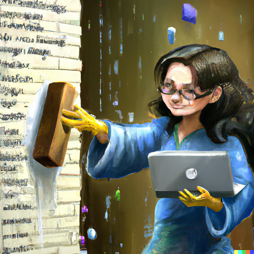
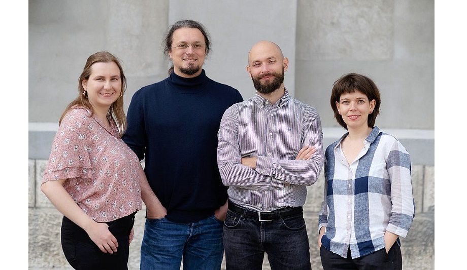

# Today's goal

Understand how using version control, clean code and documentation can be used to:

- read and maintain your code
- comply with [FAIR data principles](https://force11.org/info/the-fair-data-principles/) and [FAIR4RS principles](https://zenodo.org/record/6623556#.Y-uTsq2ZNaQ) (see also [Barker et al. 2022](https://doi.org/10.1038/s41597-022-01710-x)) 
- avoid tech debt

# Program

- 0900-0915 Introduction
- 0915-0945 Brief introduction to version control with Git
- 0945-1030 Documentation with examples from Python
- 1030-1100 Break
- 1100-1230 Clean code with examples from R
- 1230-1300 Q&A

# About us

- Email: rise@unibas.ch 
- Web: https://rise.unibas.ch/
- GitHub: https://github.com/RISE-UNIBAS
